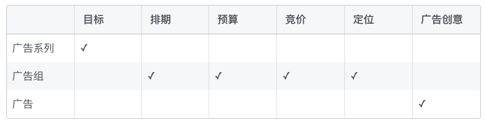
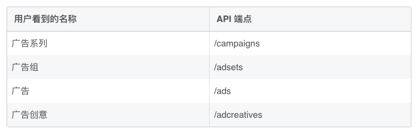

### 广告管理
1. 创建广告营销活动
2. 为广告竞拍设置竞价
3. 管理广告创意

### 广告创建流程
1. 创建广告系列
  * 使用Campaign类（1.设置标题；2.暂停广告系列；3.设置广告目标）
  * 确认广告系列是否创建成功
2. 创建广告组并设置目标受众
  * 创建广告组（广告组包括一组广告，它们拥有相同的**单日预算或总预算**、**排期**、**账单**、**优化目标**、**定位条件**）
  * 只设置目标受众，在第4步中设置其他属性
3. 设置预算、管理账单、优化目标和投放时长
  * 创建AdSet，并设置
    - 广告投放时长：start_time/end_time
    - 每日愿意花费的金额：daily_budget
    - 希望通过广告获得的成效：optimization_goal
    - 计费方式：billing_event
    - 优化事件的价值：bid_amount
  * 还可以管理账单、设置总预算等
  * 设置广告组的状态为paused，避免在测试期间产生费用
4. 构思广告创意
  * 使用`AdCreative`设计广告格式，其常用属性包括
    - 一个或多个上传的图片或视频（AdImage）
    - 设置标题、说明等
    - 在广告中添加FaceBook主页链接
    - 添加行动号召按钮
5. 排期投放
  * 通过`Ad`创建Facebook广告，可以将`AdCreative`和`AdSet`关联到表示广告的新对象，将`Ad`的status设置为paused，避免立即下单
  * 广告接受审核：PENDING_PREVIEW -> ACTIVE

### 广告架构
1. 三个层级：广告系列、广告组和广告（在API中，开发者还可以使用第四个层级——>广告创意）HH
  * 广告系列：用于确定广告目标，并包含一个或多个广告组
  * 广告组：包含一条或多条广告。
    - 需要设置广告组的预算和排期
    - 针对每组目标受众创建广告组并设置竞价
  * 广告：包含广告创意
  * 广告创意：仅包含广告的图片元素，创建后即不可更改

2. 对象名称和API的对应

#### 广告系列
1. 广告系列是广告账户组织结构的最高级别，代表广告主的单个目标
2. 在广告系列层级设置目标，有助于验证添加到广告系列下的任何广告的目标是否正确

#### 广告组
1. 广告组是指一组广告，用于配置广告投放的预算和时长
2. 广告组包含的所有广告都应该使用相同的定位条件

#### 广告
1. 广告对象包含在Facebook展示广告所需要的所有信息，如广告创意

### 目标
* 目标是指您希望用户在看到广告后采取的操作，对象是指用户的操作内容
