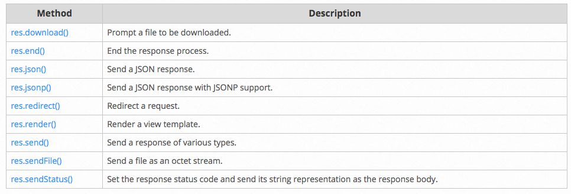

## Getting started
1. install
```
npm i express --save
```
2. express generator
```
npm install express-generator -g
```
  * use express generator to create an application skeleton
3. Basic routing
  * Routing：URI and Method
  * definition：`app.METHOD(PATH, HANDLER)`
4. Serving static files in Express
  * use the `express.static`
  * pass the name of the directory that contains the static assets to the `express.static` middleware function to start serving the files directly.
    ```
    app.use(express.static([PATH]))
    ```
  * to create a virtual path prefix for files
    ```
    app.use([VIRTUAL_PATH], express.static([PATH]))
    ```
  * use the absolute path
    ```
    app.use([VIRTUAL_PATH], express.static(path.join(__dirname, [PATH])))
    ```

## Routing
1. Routing refers to the definition of application end points(URIs) and how they respond to client requests

2. Route methods
  * Express supports the following routing methods:get, post, put, head, delete, options, trace, copy, lock, mkcol, move, purge, unlock, report, mkactivity, checkout, merge, m-search, notify, subscribe, unsubscribe, patch and search

3. Route paths
  * can be strings, string patterns, or regular expressions

4. Route parameters
  * Route parameters are named URL segments that are used to capture the values specified at their position in the URL
  * The captured values are populated in the `req.params` object
  ```
  app.get('/users/:userId/books/:bookId', function (req, res) {
    res.send(req.params)
  })
  // Request URI: http://localhost:3000/users/34/books/8989
  // res.params: { "userId": "34", "bookId": "8989" }
  ```

5. Route handlers
  * can provide multiple callback functions
  * might invoke `next()` to bypass the remaining route callbacks

6. Response methods
  * send a response to the client, and terminate the request-response cycle
  * if none of these methods are called from a route handler, the client request will be left hanging
  

7. app.route()
  * create chainable route handlers

8. express.Router
  * create modular, mountable route handlers

## middleware
### writing middleware
1. middleware function are functions that have access to the `requres object(req)`, `response objec(res)`, `next()` in the application’s request-reponse cycle.
2. can preform the following tasks:
  * Execute any code.
  * Make changes to the request and the response objects.
  * End the request-response cycle.
  * Call the next middleware in the stack.
3. To load the middleware function
  * `app.use()`
4. the order of middleware loading: middleware functions that are loaded first are also executed first
  * if middleware function is loaded after the route to the root path, the request never reaches it, because the route handler of the root path terminates the request-response cycle.
5. configurable middleware
  ```
  module.exports = function(options) {
    return function(req, res, next) {
      // Implement the middleware function based on the options object
      next()
      }
  }
  //call
  var mw = require('./my-middleware.js')
  app.use(mw({ option1: '1', option2: '2' }))
  ```
### Using middleware
1. Application-level middleware
  * is an instance of the `app object`
  * Bind using `app.use()`, `app.METHOD()`
  * use `next('route')` to pass control to the next route. use `next()` to pass control to the next middleware function
2. Router-level middleware
  * is an instance of `express.Router()`
  * using `app.use()`, `app.METHOD()`
3. Error-handing middleware
  * has four argument: `(err, req, res, next)`
  * Express has default error-handling middleware function, which is added at the end of the middleware function stack
  
4. Built-in middleware
  * `express.static(root, [options])`
  * `root` argument specifies the root directory from which to serve static assets
5. Third-party middleware

### Using template engines with Express
